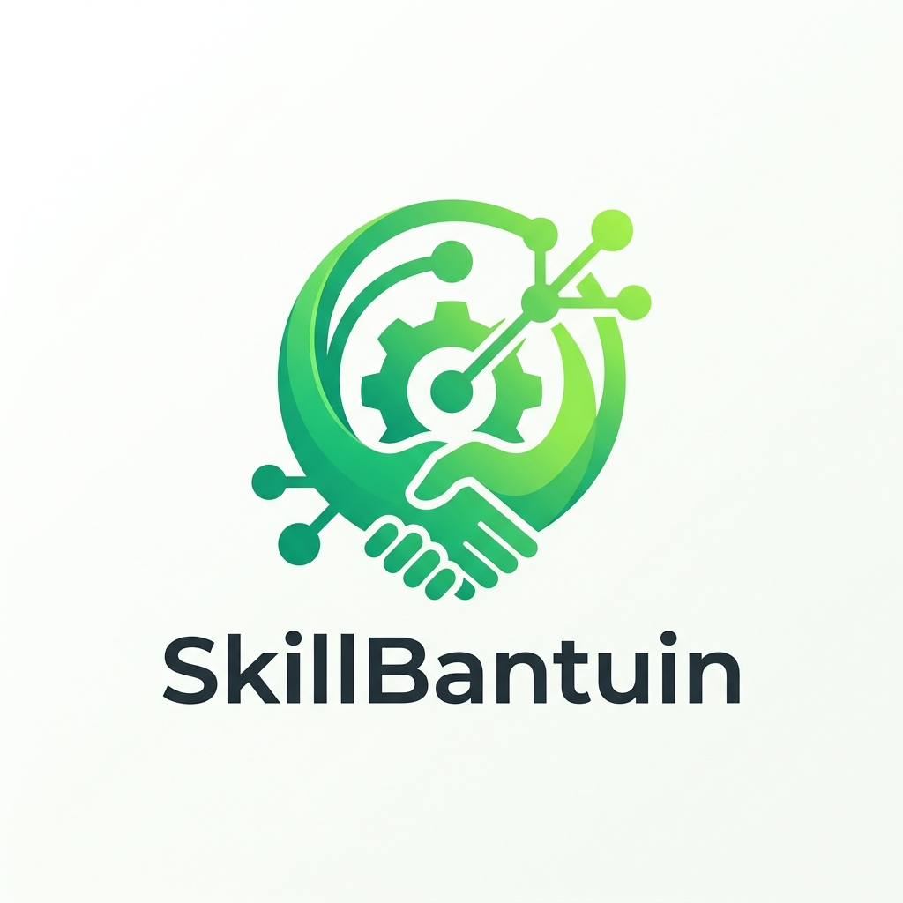
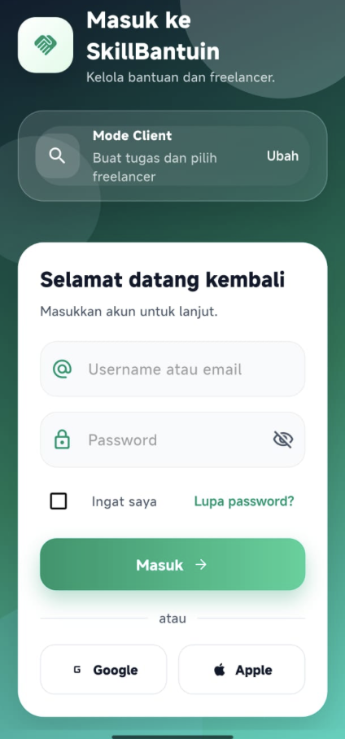
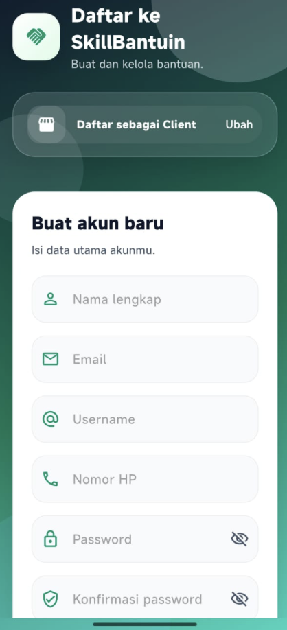
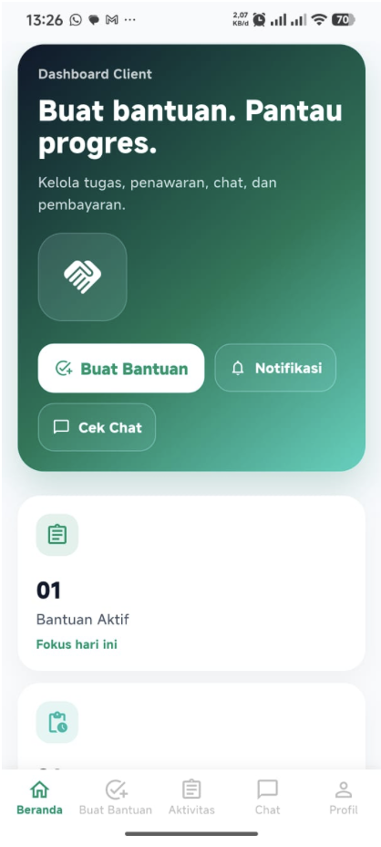
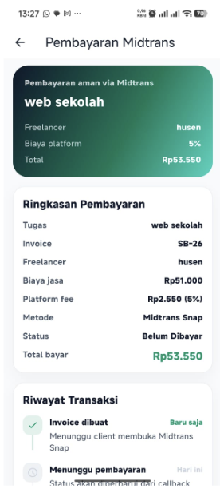
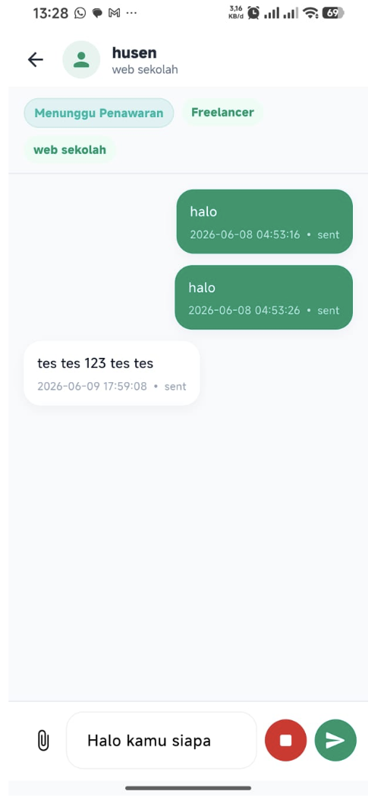

<div align="center">
  
  
  <h1>SkillBantuin Mobile</h1>
  <p>
    <b>Aplikasi Marketplace Jasa Kecil & Freelance</b>
  </p>
  
  <p>
    
    
    
  </p>
</div>

<hr>

SkillBantuin Mobile adalah aplikasi berbasis Flutter untuk platform marketplace jasa skala kecil yang menghubungkan **Client** dan **Freelancer**. 

Client dapat dengan mudah membuat permintaan bantuan, menerima penawaran dari freelancer, dan melakukan pembayaran yang aman via **Midtrans**. Di sisi lain, Freelancer dapat mencari pekerjaan, mengirim penawaran, mengunggah hasil pekerjaan, dan mendapatkan bayaran. Aplikasi ini didukung oleh backend API **Laravel** yang handal dan dilengkapi dengan fitur cerdas **Voice Recognition** pada chat.

---

## 📸 Screenshots

<table>
  <tr>
    <td align="center"><br><b>Halaman Login</b></td>
    <td align="center"><br><b>Halaman Register</b></td>
    <td align="center"><br><b>Halaman Home</b></td>
  </tr>
  <tr>
    <td align="center"><br><b>Pembayaran (Midtrans)</b></td>
    <td align="center"><br><b>Fitur Chat & Voice AI</b></td>
    <td align="center"></td>
  </tr>
</table>

---

## ✨ Fitur Utama

### 👤 Klien (Client)
- **Manajemen Project**: Membuat permintaan bantuan dan mengelola daftar project.
- **Pilih Freelancer**: Melihat profil freelancer, membandingkan penawaran, dan menerima/menolak tawaran.
- **Pembayaran Aman**: Integrasi Midtrans untuk pembayaran yang aman dan transparan.
- **Chat & Voice Recognition**: Berkomunikasi langsung dengan freelancer melalui chat yang dilengkapi dengan pengenalan suara (Speech-to-Text).
- **Review & Rating**: Memberikan penilaian terhadap hasil kerja freelancer.

### 💼 Freelancer
- **Pencarian Tugas**: Mencari dan melihat tugas berdasarkan kategori.
- **Kirim Penawaran**: Mengajukan harga penawaran dan estimasi waktu penyelesaian.
- **Upload Hasil Kerja**: Mengunggah file asli/hasil pekerjaan langsung dari perangkat.
- **Manajemen Pendapatan**: Memantau pendapatan dari penawaran yang telah diselesaikan.

---

## 🚀 Teknologi yang Digunakan

Aplikasi ini dibangun menggunakan arsitektur modern dan package andalan:

- **Frontend**: [Flutter](https://flutter.dev/) (Dart)
- **State Management**: Provider
- **Backend API**: Laravel & Laravel Sanctum (Auth)
- **Database Backend**: Oracle Database
- **Payment Gateway**: Midtrans
- **Integrasi Hardware**: 
  - `speech_to_text` (Voice Recognition / Speech-to-Text)
  - `file_picker` (Upload file)
- **Lainnya**: `http`, `shared_preferences`

---

## 📂 Struktur Direktori

```text
lib/
├── config/       # Konfigurasi aplikasi (seperti API URL)
├── models/       # Model data (Project, User, Chat, dll)
├── providers/    # State management (Auth, Project, Freelancer)
├── screens/      # Tampilan antarmuka (Client, Freelancer, Shared)
├── services/     # API request & logic bisnis
├── utils/        # Fungsi-fungsi helper dan utilitas
└── widgets/      # Komponen UI yang dapat digunakan ulang
```

---

## ⚙️ Persyaratan Sistem

- Flutter SDK & Dart SDK terbaru
- Android Studio / Xcode
- Emulator, Simulator, atau Perangkat Fisik (Sangat disarankan memakai perangkat fisik untuk fitur mikrofon/Voice Recognition)
- Backend Laravel SkillBantuin harus dalam kondisi berjalan (`php artisan serve`)
- Koneksi jaringan yang sama antara HP dan Laptop (jika debugging via WiFi/IP)

---

## 🛠 Cara Menjalankan (Getting Started)

1. **Clone & Install Dependencies**
   ```bash
   flutter pub get
   ```

2. **Jalankan Aplikasi dengan Base URL**
   Aplikasi membutuhkan alamat IP dari backend Laravel Anda. Gunakan `--dart-define` untuk menyuntikkan URL.

   - **iOS Simulator:**
     ```bash
     flutter run --dart-define=API_BASE_URL=http://localhost:8000/api
     ```
   - **Android Emulator:**
     ```bash
     flutter run --dart-define=API_BASE_URL=http://10.0.2.2:8000/api
     ```
   - **Real Device (Perangkat Fisik):**
     *Pastikan HP dan laptop terhubung di WiFi yang sama.*
     ```bash
     flutter run --dart-define=API_BASE_URL=http://IP_LAPTOP_ANDA:8000/api
     ```

---

## 🔐 Permissions (Perizinan)

Aplikasi ini membutuhkan akses mikrofon untuk fitur kecerdasan buatan (Voice to Text).
- **Android:** Membutuhkan `RECORD_AUDIO` permission (sudah dikonfigurasi di `AndroidManifest.xml`).
- **iOS:** Membutuhkan `NSMicrophoneUsageDescription` dan `NSSpeechRecognitionUsageDescription` (sudah dikonfigurasi di `Info.plist`).

---

## 📈 Status Pengembangan

Status Saat ini: **MVP Selesai** ✅

**Roadmap Fitur Masa Depan:**
- [ ] Push Notification Realtime
- [ ] Integrasi WebSocket untuk Chat Realtime
- [ ] Dashboard Statistik Advanced
- [ ] Riwayat Pencairan Dana
- [ ] Callback Midtrans Production

<br>

<div align="center">
  Dibuat Bersama oleh tim developer SkillBantuin
</div>
